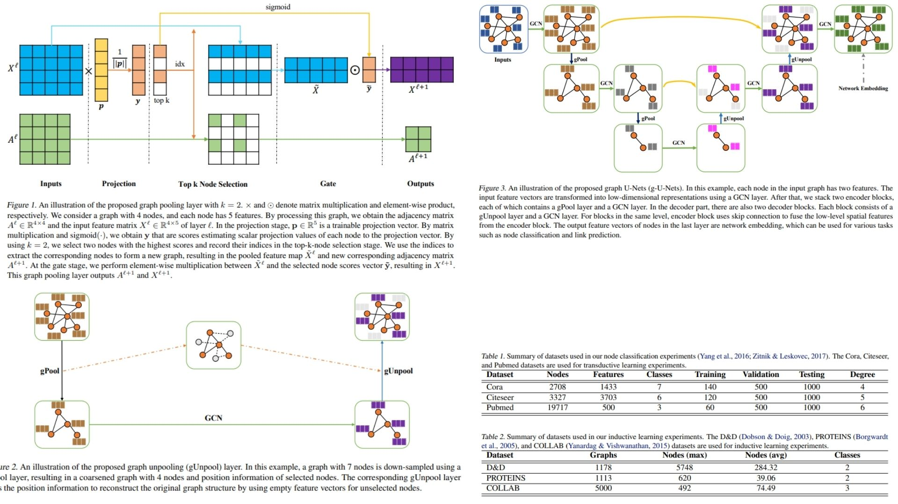

# 🎑 GraphUNet-Replication — Graph Representation Learning via Encoder-Decoder U-Nets

This repository provides a **PyTorch replication of Graph U-Nets** for node-level representation learning on graph-structured data.

The focus is **faithful implementation of the paper’s gPool/gUnpool layers, modified GCN aggregation, and encoder-decoder architecture**, rather than optimization for performance.  
It translates the paper’s mathematical formulations directly into a clean modular research codebase.

Highlights include:

- Adaptive **graph pooling (gPool)** to select important nodes  
- **Graph unpooling (gUnpool)** to restore node resolution  
- Modified **GCN layers** with enhanced self-loop weighting  
- Skip connections in encoder-decoder blocks for high-level feature propagation  

Paper reference: [Graph U-Nets (Gao & Ji, 2019)](https://arxiv.org/abs/1905.05178)

---

## Overview — Graph U-Net Pipeline 🍃



> The network encodes high-level node features using gPool layers and decodes them back via gUnpool layers, while maintaining local graph connectivity through GCN aggregation.

The pipeline combines:

- **Graph embedding layer** to reduce input feature dimensionality  
- **Stacked encoder blocks**: gPool → GCN  
- **Stacked decoder blocks**: gUnpool → GCN  
- **Skip connections** between corresponding encoder and decoder blocks  

This produces **low-dimensional node embeddings** that capture both structural and feature-level information in graphs.

---

## Graph Representation Setup 🌐

A graph is defined as:

$$
G = (V, E)
$$

Node feature matrix:

$$
X \in \mathbb{R}^{N \times C}
$$

Adjacency matrix:

$$
A \in \mathbb{R}^{N \times N}
$$

where \(N\) is the number of nodes and \(C\) is the number of input features per node.

---

## Graph Pooling (gPool) 🔹

Given a trainable projection vector \(p\), each node \(i\) is scored by:

$$
y_i = \frac{x_i^\top p}{\|p\|}
$$

Select top \(k\) nodes with largest $$y_i$$ to form the pooled graph:

$$
X' = X_{idx} \odot \tilde{y} \mathbf{1}_C^\top, \quad
A' = A_{idx, idx}
$$

where $$idx$$ are indices of selected nodes, and

$$
\tilde{y} = \text{sigmoid}(y_{idx})
$$

acts as a gate controlling information flow.


---

## Graph Unpooling (gUnpool) 🔹

Restores the graph to original size:

$$
X_{\text{out}} = \text{distribute}(0_{N \times C}, X', idx)
$$

Nodes not selected in gPool are initialized to zero, while selected nodes retain their features.

---

## Modified GCN Layer 🔹

Propagation rule:

$$
X^{(l+1)} = \sigma(\hat{D}^{-1/2} \hat{A} \hat{D}^{-1/2} X^{(l)} W^{(l)})
$$

where

$$
\hat{A} = A + 2I
$$

to assign **higher weight to self-features**, and

$$
W^{(l)}
$$

is a trainable weight matrix.


---

## Graph Connectivity Augmentation 🔹

To maintain connectivity after pooling:

$$
A^2 = A \cdot A, \quad A' = A^2_{idx, idx}
$$

This ensures that nodes in the pooled graph remain well-connected.

---

## Why Graph U-Nets Matter 🍂

- Encodes hierarchical node features while preserving graph structure  
- Skip connections improve information flow and decoding  
- Works for node classification, graph classification, and embedding tasks  
- Faithful replication of the original paper with clear math expressions  

---

## Repository Structure 📦

```bash
GraphUNet-Replication/
├── src/
│   │
│   │
│   ├── layers/
│   │   ├── gpool.py           
│   │   ├── gunpool.py            
│   │   └── gcn_layer.py          
│   │
│   ├── model/
│   │   └── graph_unet.py       
│   │
│   ├── pipeline/
│   │   └── forward_pass.py       
│   │
│   ├── utils/
│   │   └── graph_utils.py         
│   │
│   └── config.py                  
│
├── images/
│   └── figmix.jpg         
│
├── requirements.txt
└── README.md

```
---


## 🔗 Feedback

For questions or feedback, contact: [barkin.adiguzel@gmail.com](mailto:barkin.adiguzel@gmail.com)
